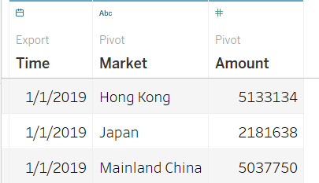

```{r setup, include=FALSE}
knitr::opts_chunk$set(echo = FALSE)
```

Distill is a publication format for scientific and technical writing, native to the web.

Learn more about using Distill at <https://rstudio.github.io/distill>.

# 1. Critic the Original Visualisation
image:  
The dataset used in above graph is provided by the Department of Statistics, Singapore, which illustrated the external trade among different countries and regions, including the numbers of dollars of total merchandise imports and exports from 1976 to 2021, explained the trade flows between Singapore and different markets.

## 1.1 Clarity
### 1)Inexact title
The title of this graph is not so precise and consistent with the content. The directivity of the question is not obvious. It is not clear exactly who is these countries' trade with, whether it is the value of their own imports and exports or the value of their trade with Singapore, and meanwhile, the exactly meaning of “top” is not well-directed, is the top number of goods or the top volume of money.  

**Suggestion**: Add the detail sub title, change the meaning of the title, and add the subject.

### 2)Vertical axis lacks label’s units
The vertical axis "0M, 2M, 4M..."and other numbers, the meaning of these expressions are not clear enough, lack of numerical units. Readers do not know whether these figures represent the number of imports and exports of goods or the total amount of trade between Singapore and these countries. Because lack of specific labels, failed to convey effective information to the readers and the purpose is unclear.

**Suggestion**:Add the units of the coordinate axis to clarify the specific meaning of the number - representing the amount of trade transactions.

### 3)Japan's graph has only one year of data
Japan had no data missing from the original dataset, and the other five countries all analyzed two years of complete data, so it is important to make sure that the analysis for all six countries comes from the same time period as possible.

**Suggestion**:Add data for 2019

### 4)Different two-side tick marks in vertical axis
From the original graph, it is not hard to see that the axis label on both sides of the vertical axis in two countries, Hong Kong and Taiwan are different. And the width of the tick marks on both sides of the vertical axis in the rest four countries are also inconsonant. This setting may cause the trend line inside the graph to deviate from the correct direction, and it is difficult to directly compare the differences in the value of imports and exports.

**Suggestion**:Modify the vertical axis to a uniform range; Change the two axes into one axis.

## 1.2 Aesthetics
### 1)Area chart may not be a very appropriate visualization method
Because the data is intended to show time-series changing and comparing import and export amounts, the use of area chart will cause trouble for readers to read, making the information of the whole graph not very clear. Meanwhile, it is quite misleading and unclear to use shadows to represent the difference, because the shadow is not only hard to identify but also cannot precisely reflect the changing of difference between import and export monthly.

**Suggestion**:Create two-line charts show the change of the import and export volume of each market in 2019 and 2020, while a bar chart shows the difference between the export volume and the import volume.

### 2)Unclear axis title
The title on the Y-axis doesn't show what the meaning and unit of the number is, so it is kind of confused to read.

**Suggestion**:Modify the Y axis title and add units.

### 3)Missing necessary commentary and annotation
The whole graph has not highlight necessary and concise commentary and annotation.

**Suggestion**:Add the necessary commentary and reader-friendly annotation according to the final chart.

### 4)Not suitable for the current graph color matching
There is no big problem with the color matching between blue and orange. However, as he tried to use shadow to show trade surplus deficit, orange will cover blue, causing confusion between the color of shadow and orange, which is not easy to read.

**Suggestion**: Modify color combinations to better match and fit.

# 2.Proposed Data Visualisation
## 2.1 A sketch of proposed design
image:  

## 2.2 Advantages of proposed design
### 1)Improved the correctness of graph title:
Add more detailed sub titles and the readers can more clearly understand the main purpose and the content of the chart.

### 2)Select a combination of line chart and bar chart to visualize data:
The expansion of one chart into three i. clearly shows the trend and size of each region’s trade in 2019 and 2020; ii. more intuitively shows the positive and negative values of the trade to identify the trade is deficit or not.

### 3)Well defined axis label and appropriate thick marks:
The previous chart lacked units on the vertical axis, so the numerical significance of the vertical axis was not clear. The addition of units and unified thick marks made it more convenient to compare the difference value of each region.

### 4)Improved color matching:
Adopted a more harmonious color match than before to increase the aesthetic.

### 5) More information is showed from Dataset  
It reflects the trend of trade volume between Singapore and six major markets, and more intuitively reflects the relationship between exports and imports in different markets in different months.  

# 3. Data Visualisation
The data file consists of three worksheets: Content, T1 and T2. First need to rename T1 to Import and T2 to Export, then delete useless worksheet Content.
image:  
These two datasets include data for 119 countries and regions from January 1976 to April 2021.

The final visualisation consists of three parts, which are  
Table 1 -- Changes of export value in Singapore.  
Table 2 -- Changes of import value in Singapore.  
Table 3 -- Changes of balance of trade.  

## 3.1 Data Preparation
**For Import dataset (Table 2)**

<<<<<<< HEAD
1) Remove redundant columns and rows.
=======
1)Remove redundant columns and rows.
>>>>>>> c844d8ee66f437d20b9e398bbc209cc82d656130
Delete extra columns and only keep data from January 2019 to December 2020.  
image:  

Use Filter to delete data of other markets, leaving only six rows of data – Hong Kong, Mainland China, Japan, Taiwan, Malaysia and U.S.
image:  

<<<<<<< HEAD
2) Rename header and country names
Rename header from “Variables” to “Markets” and delete “Thousands Dollars” in each row.
image:  

3) Transpose dataset
=======
2)Rename header and country names
Rename header from “Variables” to “Markets” and delete “Thousands Dollars” in each row.
image:  

3)Transpose dataset
>>>>>>> c844d8ee66f437d20b9e398bbc209cc82d656130
For better identification in Tableau, we need each country as a column and each time as a column, so copy all the data in Excel first and then use Transpose function to process the data.  
image:    
Then rename the headers the new dataset showing as following:  
image: 

<<<<<<< HEAD
**For Export dataset (Table 1)**

1) Repeat the same three steps in Import dataset
=======
**For export dataset (Table 1)**

1)Repeat the same three steps in Import dataset
>>>>>>> c844d8ee66f437d20b9e398bbc209cc82d656130
image:  

**For Table 3**

<<<<<<< HEAD
1) Create new worksheet to calculate the difference
=======
1)Create new worksheet to calculate the difference
>>>>>>> c844d8ee66f437d20b9e398bbc209cc82d656130
Create a new worksheet called "Balance of Trade" and use function “Export minus Import” to calculate the difference. 

If exports are greater than imports, that means the difference is greater than zero, then Singapore has achieved a Trade surplus in this period. If exports are smaller than imports, that means the difference is less than zero. This indicates that Singapore has a trade deficit with the country during this period.
image: 

<<<<<<< HEAD
2) Save the new Excel file as “Trade Data” and derive new Tableau workbook then import the file.

## 3.2 Data Visualisation
1) Create relationship between these three datasets
Combine these three datasets by using column “Time”.
image: 

2) Pivot two datasets
Because countries from Malaysia to the U.S are spread across multiple columns, we need to select the them then right click and use “Pivot” to change it in the correct format. Repeat this step in “Import” and “Export” datasets.
image: 

3) Rename headers
For Export dataset, rename the first “Pivot Field Names” to “Market” and rename the second “Pivot Field Values” to “Amount”.
image:   

And also do the same step in the Import datasets, rename the first “Pivot Field Values” to “Market 2”, the second to “Amount 2” respectively.

**For Export dataset (table 1)**  

Create new sheet and name as “Export”.

1) Change data type  
Change “Time” data type from string to date, and change “Export Trade Amounts” data type to “Number (whole)” then to the right side click “Convert to Continuous”.
image:     

2) Create line chart
Drag “Time” and “Export Trade Amount” to Columns and Rows respectively.
Then change the format of “Time”.
Click the little arrow of “Year (Time)” change Time to Year and next Time to Month. 
image:    

3) Change the months in X-axis into numbers
Right click on the X-axis => Format => Dates => Numeric.  
image:   

4) Apply Color
Drag “Market” to color option, change “Automatic” to “Line” and change “Markers” to the second option, which in order to more clearly correspond to each time node. 

5) Change the number format.
Right click on Y-axis => Format, then go to pane option, change the Numbers to Currency (Standard) => English (Singapore).  
image:   

6) Change “Standard” to “Fit Height”  

7) Add title
Add title - Changes of export value in Singapore. Next to adjusted the title to right color, location and size.  

**For import dataset (Table 2)**  

1) Create a new Sheet, named as “Import” and repeat the first 6 steps in Table1.  

2) Add title
Add title: Changes of import value in Singapore and change the right color, location and size.  

**For Table 3:**  

1) Change data type
Change Time from String to Date, change Japan, Taiwan, Malaysia, United States, Mainland China and Hong Kong from String to Number (whole), and convert all to continuous.  

And as showing in the previous step, click on the small arrow changing Time to Month  format.   
image:    

2) Create bar chart 
Drag “Time” and “Hong Kong, Japan, Mainland China, Malaysia, Taiwan and United State” to Columns and Rows respectively.
Change Time to Year and next Time to Month.
image:     

3) Apply colors one by one.
Drag country name to Color option, double-click on Legend on the right, edit color to 2 steps – Positive difference is dark blue, negative is light blue.  
Apply the same color group in each country. 
image:   

4) Adjust the range of the Y axis
Except Hong Kong and Taiwan, to adjust the range of the rest five countries to be the same. Edit axis range to Fixed and start with -2,492,896 (the lowest value of a negative number in the five countries Automatic), end with 2574795 (the largest positive number of automatic in five countries). And for Hong Kong, only change the Fixed end with -1000000, for Taiwan, start to 1000000.    
image:   

5) Add annotation
A positive value above the zero mark indicates a trade surplus, while a negative value below indicates a trade deficit.  
image:   

6) Change the months in X-axis into numbers
Right click on the X-axis => Format => Dates => Numeric.

7) Add title
Add title: Changes of balance of trade.   

**For Dashboard 1**  

1) Delete extra Legend.
There are a lot of redundant Legends on the right side of Dashboard, which look very messy, so it needs to be removed.  

2) Change the size
Change the size to Automatic.  

3) Add and format title
Add title: Changes of merchandise trade volume in Singapore with the top six countries, 2019-2020.  
Format title: add grey shading.  

4) Add commentary  
Add commentary below the title in Table 3: The balance of trade = Export – Import Unit: thousands dollars.  
Add sub title of Y-axis in Export and Import graphs. Sub title: $thousands.  

5) Add source
Choose Objects => Text => drag to bottom left and add:  
Source: Statistic   Singapore[Link](https://www.singstat.gov.sg/)

## 3.3 Final Visualisation
image:  

# 4 Observations
## 4.1 Singapore's main trading partner is Mainland China  

As can be seen from the line chart on the right, trade between China and Singapore is the largest in both 2019 and 2020. Exports fluctuated from January to July 2019, rising significantly until July, and then dropping to normal levels in August. Exports began to rise slowly after August. And the same trend is seen in 2020 too. Although the export volume of Singapore to the Mainland China declined slightly from January to May 2020, it has seen a significant increase since July, and its export volume is much higher than that of the second place Hong Kong.  

In terms of imports, both 2019 and 2020 showed a similar pattern from January to March - Singapore's imports from China dropped from January to February, then rose sharply in February. From March to October, it showed a relatively gentle fluctuation, rising from October to November and then falling.  

## 4.2 Singapore's main export market is Hong Kong and its main import market is Taiwan.  

As can be seen from the bar chart on the left, both in 2019 and 2020, Singapore's imports are greater than exports, presenting a trade deficit with Taiwan.
The exact opposite situation appears in the trade between Singapore and Hong Kong - for two years, exports exceeded imports, that is, trade surplus, showing a high profit pattern.  

## 4.3 Trade deficits are more common in 2020 than in 2019  

Excluding two regions, Taiwan and Hong Kong, the bar chart with negative numbers in 2020 is more than that in 2019.
As can be seen from the chart of the United States, both Singapore and the United States had a trade surplus throughout 2019. However, since 2020, the net export volume has been decreasing month by month, and it has been in a trade deficit since April. Although the net export volume was slightly positive in September and October, it still fell back to the state of exports being less than imports. It has had a trade surplus with China since August, but has been in deficit with Malaysia since 2020.


