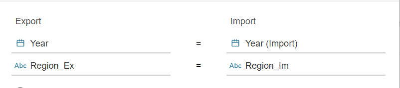
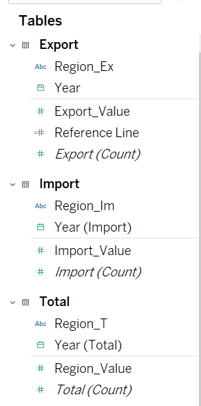
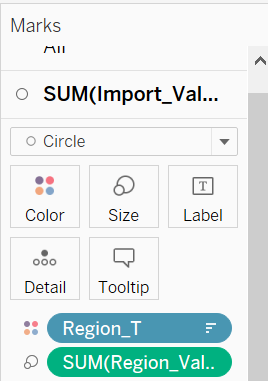
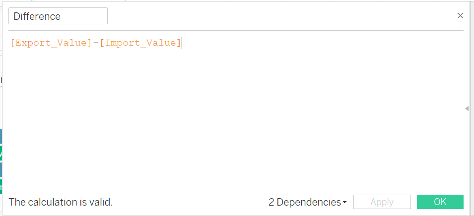

```{r setup, include=FALSE}
knitr::opts_chunk$set(echo = FALSE)
```

# 1. The original visualization

The data comes from the [Singapore Statistic](https://www.singstat.gov.sg/find-data/search-by-theme/trade-and-investment/merchandise-trade/latest-data), which records the monthly volume of imports and exports of Singapore by varies of regions/markets from January 1976 to April 2021. And this report is going to visualize the merchandise trade changes between different countries with Singapore during 2011 to 2020.

# 2.Comments on the clarity and aesthetics.
## 2.1 Clarity
No.|                  Critiques                       |Suggestion
---|--------------------------------------------------|-----------------------
1  |**The solid circles showed transaction volume of different regions covered each other.** Such as EU, more than half of the dark blue one has covered by United States, the turquoise circle. The same thing happened in Republic of Korea, which was almost entirely covered by Japan. This leads to an incomplete representation of the trade volume information in the diagram, readers cannot compare the size of transactions in different regions.|We can filter different countries in Tableau in order to choosing either individual countries or all of those.
2  |**The content of commentary and chart are inconsistent. **Commentary should be based on the charts that have been made. The original chart did not show any information about changes of dates (years), but commentary mentions two specific years which is 2006 and 2009, are not supported by chart data. |Commentary is written based on the content of Graph to supplement interesting observations of details in Graph, so we can focus on main observations.
3  |**lack of indicating which time periods are used in the chart. **The original Visualization did not specify the period of time for the merchandise trade being studied, and also lacked clear notations. Therefore, it will cause misunderstanding for readers. |Change the form to interactive visualization, highlights the time change by turning the time into a reader-selectable option.
4  |**Missing graph title. **The original graph did not set an appropriate title to summarize the main content, so is short of highlighting the point that intended to express. | Add appropriate graph title.

## 2.2 Aesthetics
No.|                 Aesthetics                       |Suggestion
---|--------------------------------------------------|-----------------------
1  |**The choice of background color is not appropriate. **There are already varies of colors and labels of regions in the graph, and the light blue and green background colors that represent Net Import and Net Export belong to the same color range with some regions’ circles, hard for readers to clearly distinguish and makes the whole graph messy. |Do not set another background color. Keep the transparent color.
2  |**Static bubble plot may not be the most appropriate visualization method.**Because the raw data include the imports and exports volume changes through years between different regions and Singapore, the original chart does not capture this dynamic demand well. |Add Animation funtion in Tableau.
3  |**Note's position is not impressive enough. **The font of notes is too small for the reader to recognize below the graph, and the position is also not so obvious. |Change the Note in front of the graph or change the color and font of it.
4  |**Inappropriate location for axis title.**Crossing titles on the horizontal and vertical axes in the lower left corner can be misleading, since Exports is more like vertical title, while Imports are closer to the horizontal axis. The locations need to be changed. |Place the names of the axes halfway between the horizontal and vertical axes.

# 3. Sketch Design
## 3.1 Sketch
## 3.2 Advantages
1)Added timeline options.
The static Bubble Plot has been turned into an interactive mode. Reader can drag the time option to observe the changes in the amount of trade between Singapore and different countries at different times,which can help Reader to choose the time more accurately.

2)Add appropriate titles and commentary to make the directivity and content of plot clearer.

3)Add a filter option to allow users to freely select the country to view.

4)Reduce the use of the same color range of background, the overall chart looks clean and tidy.

# 4. Data Visualization
## 4.1 Data Preparation Process
There are 3 worksheets in the original file, “T1” means the merchandise imports in Singapore by different region/market, “T2” means the merchandise exports in Singapore by different region/market, monthly during 1976 Jan to 2021 April, including 121 rows in total.

First to clean the redundant worksheet “Content” and delete needless content in T1 and T2 datasets, renamed as “Import” and “Export” respectively.

**For Import Dataset**

1. Clean Data
In order to observe the data better and not be affected by the maximum value, we need to delete the continent representing the collection of countries such as Europe, Asia, Africa and America, and finally keep the 82 countries are both shown in Export and Import dataset. Meanwhile, it was found that the value of "Germany, Democratic Republic Of" and "Yemen Democratic" from 2011 to 2020 were zero, so they were deleted also. The new dataset was shown below:


2. Sum each year and transpose data
In Export Worksheet, add up the monthly data from 2011 to 2020 according to different years, then copy => Transpose. The result:


**For Export dataset**   
3. Repeat the same 2 steps  

4. Add new worksheet “Total”  
Add the Import and Export values for each country correspondingly in a new worksheet named "Total". The formula is:


Then the data preparation steps in Excel is all done, save this file as “Data Final”.

## 4.2 Data Visualization Steps  

Import the Excel “Data” into Tableau

1. Pivot and connect three datasets
First pivot each dataset, select the data from 2011 to 2020, right click => Pivot, and rename the Import new pivot columns as follow:  


And also change the Export as “Country_Ex” and “Export_Value” respectively, the columns in Total as “Country_T” and “Total_Value”.  

Then connect three datasets by same columns - Country and Year.




2. Change the data type
Change all the Year data type from “String” to “Date”


3. Create bubble plot
Drag “Export_Value” and “Import_Value” to Columns and Rows respectively.  


4. Set size and color
Drag “Country_T” to Color.
Drag “Total_Value” to Size.
Change the Marks to Circle.  
  

Right click on “Country_T” => “Sort”, change the setting as descending in order of "Total_Value".  
 

5. Apply filter and pages.
Right click on “Country_T” => Sort, manually adjust the order of countries as shown in the Color panel above as the same, therefore, in the control panel of Filter, the trade volume of each country can be sorted according to its size:
 

Then,drag “Country_T” to Filter, choose all of the countries, then left click => Show Filter.  
  

Drag “Year (Total)” to Pages, the panel shown below:  


6. Format horizontal and vertical axes   
Right click on each axis => Format.   
In the Pane interface, Numbers => Currency (Custom) => Billions (B), only keep one decimal places.  


7. Turn on Animations
Format => Animations, open the animations. Set the Duration to smooth speed, 1 seconds (Slow).


8. Create New Calculated Field
1)Create new column named Trade Balance, compare export and import value, and if export > import, means Singapore has a trade surplus with the country, if import > export, means Singapore has a trade deficit with the country.


2)Create new column named Difference,it's the value of export minus the value of import


9.Justify Tool tip
Drag “Trade Balance” and "Difference" to Tool tip, then justify as shown below:


Then change the format of "Difference" to the same as other numbers.

10. Add Drop Lines
Right click on circles => Drop Lines => Show Drop Lines

11. Add Labels
Drag "Country_T" to Label

12. Add Commentary
From 2011 to 2014, Singapore's largest trading partner was Malaysia, and after 2014, mainland China became the largest trading partner.

**For Dashboard**
1. Add Tittle
Add tittle: Changes of Merchandise Trade Volume with Singapore,2011-2020.

2. Adjust the Legend
Delete the Sum_Total panel

