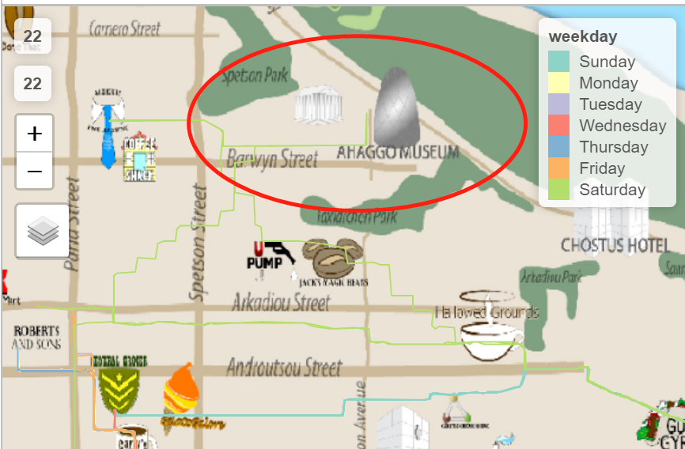

```{r setup, include=FALSE}
knitr::opts_chunk$set(echo = TRUE)
```

# 1.Overview
## 1.1 Background
This report is based on the mini challenge 2 from [VAST Challenge 2021](https://vast-challenge.github.io/2021/). Here is the background: 

GAStech, an oil-products company from Tethys, is expanding into Kronos - an island country, built good relations with the local government as well.Not only GAStech got considerable profit, but also has an impact on the local natural environment.
At the beginning of 1997,the residents of Elodis agricultural town located near the capital of Kronos began to pay attention to an abnormal increase in the occurrence of illnesses such as cancer and birth defects.And they believe this is related to Gastech's business. The residents set up their own POK (Protectors of Kronos) organization to protect the ecological environment in Kronos and prevent continuous deterioration.

During Gastech's celebration party in 2014, the unexplained disappearance of some employees was suspected to be related to the POK organization. And now we got the employees' credit card and loyalty card transaction data, and also their GPS record, to identify anomalies. Due to this, the purpose of this report is to analyze the consumption behaviors of employees at different times and places, use R Studio to visualize the data, screen the existing suspicious behaviors, match the employees with varies of crads, and draw suggestions and conclusions.

## 1.2 literature review
R Studio was originally developed by Robert Gentleman and Ross Ihaka, an integrated development environment (IDE) for the R language. It is a standalone open source project that integrates many powerful programming tools into an intuitive, easy-to-learn interface. This visualizing analysis is based on R Studio, therefore, will introduce some of the R packages. 

The tidyverse is a language for solving data science challenges with R code, encompasses the repeated tasks at the heart of every data science project:data import, tidying, manipulation, visualization, and programming. Its primary goal is to facilitate a conversation between a human and a computer about data.(Hadley Wickham, Mara Averick,etc,2019)

The tidyverse also provides the ggplot2 (Wickham, 2016) package for visualization. [ggplot2](https://ggplot2.tidyverse.org/) is a system for declaratively creating graphics, based on The Grammar of Graphics (Wilkinson, 2005).Data transformation is supported by the core dplyr (Wickham et al., 2019a) package. [dplyr](https://dplyr.tidyverse.org/)
provides verbs that work with whole data frames, such as mutate() to create new variables,filter() to find observations matching given criteria.  

R can be used for visualization and supports various types of charts. It supports
many applications that can be visualized in a simple and contains most of the
information in the plot.The library ggplot() supports visualization for various formats of data and machine learning models. The other libraries that support visualization in R are ggiraph, digraph, ggVis and so on(K. G. SrinivasaSiddesh G. M.Srinidhi H.,2018).


## 1.3 Dataset introduced
MC2 includes 4 CSV format files and a tourist map of Abila with locations of interest identified.  
-- Car-assignments: includes 45 detailed records of vehicle assignments by employees.  
-- Cc_data: contains 1491 credit and debit card transaction amount records in various of locations.  
-- Loyalty_data: 1393 observations of loyalty card transaction of GAStech's employees.  
-- Gps: records the latitude and longitude by each employees' track.

# 2. Data preperation
## 2.1 Import data 
### 2.1.1 Install R packages 

The first step is to install all the packages we will use in a follow-up study. Here will give brief introduction of some packages.  

We use **Tidyverse** to manipulate and clean original dataset, includes ggplot2(wich is mainly for data visualization), dplyr, tidyr, and purrr. **GGiraph** is to make ggplot interactive with users. **Plotly**'s R graphing library makes interactive, publication-quality graphs.The goal of **patchwork** package is to make it ridiculously simple to combine separate ggplots into the same graphic. **visNetwork** is an R package for network visualization. **lubridate** can help to make up for R Studio's lack of processing time data and makes it much easier. The aim of **magrittr** is to decrease development time and improve readability and maintainability of code. With the **tmap** package, thematic maps can be generated with great flexibility. The **raster** package provides classes and functions to manipulate geographic data in ’raster’ format. **igraph** is a collection of libraries for creating and manipulating graphs and analyzing networks.

```{r}
packages = c('ggiraph', 'plotly', 'DT', 'patchwork',
             'tidyverse','visNetwork','clock','lubridate',
             'raster', 'sf','tmap','rgdal',"dplyr",'ggraph',
             'igraph','tidygraph','magrittr')
for (p in packages){
  if(!require(p, character.only = T)){
    install.packages(p)
  }
  library(p,character.only = T)
}
```

### 2.1.2 Files importing
Import the four datasets.

```{R}
LoyaltyCard <- read.csv("D:/Study/Visual Analytics/Assignment/MC2/loyalty_data.csv")
CC <- read.csv("D:/Study/Visual Analytics/Assignment/MC2/cc_data.csv")
GPS <- read.csv("D:/Study/Visual Analytics/Assignment/MC2/gps.csv")
CarTrack <- read.csv("D:/Study/Visual Analytics/Assignment/MC2/car-assignments.csv")
```

Here is a roughly view of information in each dataset.

```{r}
glimpse(LoyaltyCard)
glimpse(CC)
glimpse(GPS)
glimpse(CarTrack)
```
We can find some columns' data types are incorrect, we will change it by following steps.

## 2.2 Clean and tidy data
### 2.2.1 Missing values checking

The first thing to do is to check whether there is missing value, and we find CarTrack dataset has missing value just on car ID, it is useful for us to see if there is private use of the bus problem, so do not delete.

```{r}
which(rowSums(is.na(LoyaltyCard))==TRUE)
which(rowSums(is.na(CC))==TRUE)
which(rowSums(is.na(GPS))==TRUE)
which(rowSums(is.na(CarTrack))==TRUE)
```

If the result gets 0, means the inexistence of missing. We can draw from the conclusion that three of the datasets do not have any missing except CarTrack. If we go back to check this dataset, we will find that the missing values are all the IDs of drivers whose in Gastech company, which are not very useful for our subsequent research, so we can choose to delete them by using na.omit function.

### 2.2.2 Adjust data type and format  

From our previous brief glimpse of the data, the data type of "timestamp" column is incorrect. It should be in "date" format but is mistaken for "character" format, so here we use date_time_parse to modify it, and also extracts the hours and days as new columns in "CC" and "LoyaltyCard" respectively.

For **CC** dataset:

```{r}
CC$timestamp <- date_time_parse(as.character(CC$timestamp),
                zone = "",
                format = "%m/%d/%Y %H:%M")
CC$weekday = wday(CC$timestamp, 
                  label = TRUE, 
                  abbr = FALSE)
CC$hour <- as.numeric(get_hour(CC$timestamp)) #extract hour as new column
a <- as.character(CC$timestamp)
```

For **LoyaltyCard** dataset:

```{r}
LoyaltyCard$timestamp <- date_time_parse(as.character(LoyaltyCard$timestamp),
                zone = "",
                format = "%m/%d/%Y")
LoyaltyCard$Weekday = wday(LoyaltyCard$timestamp, 
                             label = TRUE, 
                             abbr = FALSE)
LoyaltyCard$day <- as.factor(get_day(LoyaltyCard$timestamp)) #extract day as new column
```

### 2.2.3 Derive new column

In the CarTrack dataset, we found the first name and last name were mistakenly divided into two columns, due to this, we combined them into one column with paste function.

```{r}
CarTrack$Name <- paste(CarTrack$FirstName, CarTrack$LastName)
CarTrack <- CarTrack %>% 
  select(CarID,CurrentEmploymentTitle,CurrentEmploymentType,Name)
```

### 2.2.4 Rename some text data

Because one of the location name is in Greek format, we need to change it into English, and also delete all the single quotes, it may cause misleading for following code.

```{r}
LoyaltyCard$location <- gsub("'", '', LoyaltyCard$location)
LoyaltyCard$location[LoyaltyCard$location=="Katerina’s Café"]<-"Katerina Cafe"
```

# 3 Find anomalies 
## 3.1 Identify the most popular locations
### 3.1.1 For loyalty card transactions

Create new dataset named "LoyaltyCard_3", use group_by function to count the number of occurrences at each location during this period. We will use this dataset for further visualization.

```{r}
LoyaltyCard_3 <- LoyaltyCard %>% 
  select(location) %>%
  group_by(location) %>% 
  summarize(weight =n()) %>%
  arrange(desc(weight))

glimpse(LoyaltyCard_3)
```

First to visualize the total loyalty card transaction number within 14 days in each locations of Kronos.

```{r}
Bar <- plot_ly(data=LoyaltyCard_3,
  x = ~weight,
  y = ~location,
  type = "bar",
  text = ~paste("location:", location,
                "<br>Number of times:", weight),
  marker = list(color = 'rgb(158,202,225)',
           line = list(color = 'rgb(8,48,107)', width = 1.5))) %>%
  layout(xaxis = list(title = 'Number of times'),
         yaxis = list(title = "",
                      categoryorder = "array",
                      categoryarray = ~weight),
    title ='Total number of loyalty card transactions')

Bar
 
```

We can find the most three popular places among employees who are using loyalty card to buy from GASTech company are cafe shop and restaurant, Katerina's Cafe, Guy's Gyros and hippokampos, it seems that they are in the habit of drinking coffee on a regular basis, and it may be speculated that they are in the habit of meeting customers in a cafe or having a conversation to relax.

Then we group the data by day in order to showing the changes in each day and name it as LoyaltyCard4.

```{r}
LoyaltyCard_4 <- LoyaltyCard %>% 
  select(location,Weekday) %>%  
  group_by(Weekday,location) %>%  
  summarize(Count=n())

glimpse(LoyaltyCard_4)
```

Plotly is a very useful package to make interactive, publication-quality graphs with the reader. Will use plotly to make interactive bar chart, which can select different day in the control panel.

```{r}

BAR3 <-  plot_ly(data=LoyaltyCard_4,
    x = ~Count, 
    y = ~location, 
    color = ~location, 
    frame = ~Weekday, 
    text = ~paste("Day:", Weekday,     
                  "<br>Count:", Count,
                  "<br>location:",location),
    hoverinfo = "text",
    type = 'bar',
    mode = 'markers'
  ) %>%
layout(title ='Most popular location of loyalty card transaction by weekday')


BAR3
```

From the graph we can use the control panel to see the most popular place on Sunday is Hippokampos, then is Katerina's Cafe. On Monday is Brewve Been Served, following by 	
Katerina Cafe, which is the most popular place on Tuesday and Thursday too. The most popular location on Wednesday and Friday is a combination of Monday and Tuesday, Brewve Been Served and Katerina Cafe.

So we can conclude that the most popular location for GASTech employees are Brewve Been Served and Katerina Cafe, thsy will always choose these two place to have a rest and eating.

### 3.1.2 For credit card transactions
First to create new dataset which incoludes location, hour and the number of visits GASTech employees have made to these locations, named CC_4.

```{r}
CC_4 <- CC %>%
  select(location,hour) %>% 
  group_by(location) %>%  
  summarize(Count=n()) %>%
  arrange(desc(Count))
```

Create the basic bar chart for initial visualization.

```{r}
Bar4 <- plot_ly(data=CC_4,
  x = ~Count,
  y = ~location,
  type = "bar",
  text = ~paste("location:", location,
                "<br>Number of times:", Count),
  marker = list(color = 'rgb(158,202,225)',
           line = list(color = 'rgb(8,48,107)', width = 1.5))) %>%
  layout(xaxis = list(title = 'Number of times'),
         yaxis = list(title = 'location',
                      categoryorder = "array",
                      categoryarray = ~Count)) %>%
  layout(title ='Total number of credit card transactions')

Bar4

```

We can see the same conclusion from using loyalty card. The most popular places for employees to go are cafes and eating places. And then we create heatmap to see the changes of each hour.

```{r}
CC_5 <- CC %>% 
  select(location,hour) %>%  
  group_by(location,hour) %>%  
  summarize(Count=n())
```

Here we use heatmap to do visualization.

```{r}
Heatmap <- plot_ly(data=CC_5,
                   x= ~hour,
                   y= ~location,
                   z= ~Count,
                   text = ~paste("Hour:", hour,     
                                 "<br>Count:", Count,
                                 "<br>location:",location), 
                   hoverinfo = "text",
                   type = "heatmap") %>%
  layout(tittle = 'Most popular location of credit card transaction by hour')
Heatmap

```

GASTech employees present a tracked pattern throughout the day. At 7-8 am in the morning, Brew've been served is the most popular place and also the Hallowed Grounds. Then they will go to work until 12 am to 13 am, chose to have lunch. At 8 p.m in the evening, maybe it is the time they leave work, go to cafes and restaurants to relax and eating.

* The first unusual thing is there are 5 credit card purchases records at 3 am in Kronos mart. 
* Eight o 'clock in the evening is the peak time for employees to go to cafes and restaurants, which means
  they can leave work only after that time, having overtime problems. 
* Between 3 p.m. and 6 p.m., which is the working time, Albert's Fine Clothing appeared five times in the
  credit card consumption record. That is to say, there may be some employees who use their working time to
  go shopping.
* Between 12pm and 2pm, a total of 55 credit card purchases were made at Ouzeri Elian, which is likely to be a pub, so there is speculation that some staff may have been involved in drinking on duty.
* A total of five purchases were made in the Chotus Hotel between 12:00 and 1:00 p.m., and only one hour was spent in the Hotel before leaving, which is also a bit strange, but more specific research is needed.

## 3.2 Data Visualization
### 3.2.1 Visualize the route for each ID

First to import the map file and create the initial map.

```{R}
bgmap <- raster("D:/Study/Visual Analytics/Mavis-yuuu/Mavis_blog_ISSS608/_posts/2021-07-12-assignment/MC2-tourist.tif")
bgmap
tm_shape(bgmap) +
tm_rgb(bgmap, r = 1,g = 2,b = 3,
       alpha = NA,
       saturation = 1,
       interpolate = TRUE,
       max.value = 255)
```

Then change the gps data format.

```{r}
Abila_st <- st_read(dsn = "./Geospatial",
                    layer = "Abila")
gps <- read_csv("D:/Study/Visual Analytics/Assignment/MC2/gps.csv")
glimpse(gps)

gps$Timestamp <- date_time_parse(gps$Timestamp,
                zone = "",
                format = "%m/%d/%Y %H:%M:%S")
gps$weekday = wday(gps$Timestamp, 
                  label = TRUE, 
                  abbr = FALSE)
gps_sf <- st_as_sf(gps, 
                   coords = c("long", "lat"),
                       crs= 4326)
gps_sf
```

Derive the path data.

```{r}
gps_path <- gps_sf %>%
  group_by(id, weekday) %>%
  summarize(m = mean(Timestamp), 
            do_union=FALSE) %>%
  st_cast("LINESTRING")
gps_path
```

Visualize the gps data by each id.

```{r}
gps_path_selected <- gps_path %>%
arrange(desc(id))

tmap_mode("view")
tm_shape(bgmap) +
  tm_rgb(bgmap, r = 1,g = 2,b = 3,
       alpha = NA,
       saturation = 1,
       interpolate = TRUE,
       max.value = 255) +
  tm_shape(gps_path_selected) +
  tm_facets(by = "id",ncol = 1) +
  tm_layout(legend.show=FALSE) +
  tm_lines(col = "weekday", lwd = 7)
```

```{r}
gps_path_selected <- gps_path %>%
filter(id == "28")

tmap_mode("view")
tm_shape(bgmap) +
  tm_rgb(bgmap, r = 1,g = 2,b = 3,
       alpha = NA,
       saturation = 1,
       interpolate = TRUE,
       max.value = 255) +
  tm_shape(gps_path_selected) +
  tm_facets(by = "weekday",ncol = 1) +
  tm_layout(legend.show=FALSE) +
  tm_lines(col = "weekday", lwd = 7)
```
#### 3.2.1.1 Identify unusual behaviors
**1**.Some of employees may have the problem of drunk driving and drunk working, such as Nils Calixto for Car ID 1, Ingrid Barranco for Car ID 4 and so on.  
For example, we can first analyze two employees, see from the path pictures. On Friday and Thursday for ID1 and Wednesday and Thursday for ID4, these two persons went to Ouzeri Elian many times, so we could assume he was driving under the influence. Due to time data limitations, we can only speculate that he may have been drinking on duty, since he needed to work on those two days.  


**2**. Car ID 3 visits Alberts Fine Clothing almost every day
If we carefully observe Felix Balas's road map, who is an engineer, we can find his paths almost meet at the clothing store every day. Therefore, we can conclude that he visits the clothing store very frequently. One possibility is that he has the need to buy clothes, and the other possibility is that he has other problems.


**3**. The employee with Car ID 9 drives the long distance from the company to shop at Bean There Done That almost every day.

   
Gustav Cazar, who is an drill technician, his paths during weekday are very similar. Almost every day, he chose to drive to the coffee shop far away from the GASTech company, but rarely choose the coffee shop close to the company and more employees choose, which is a bit strange.

**4**.Car ID 21, 22 and 34 all went to the museum on Saturday.
All three were from the security services, so it's not ruled out that they made an appointment to visit the museum together on Saturday.  

  



**5**. Isia Vann with car ID 16 will go to Frydos Autosupply n More everyday.

Whether on weekends or during the week, this employee would choose to drive to the place.

**6**. Car ID7 and ID33 went to CHOSTUS Hotel at the same weekday on Tuesday, and they came from the same department, engineering and the same current employment title.


According to their first name, Elsa is a female name, and ID33 named Brand is a male name. and also according to the above information, we can suspect that they have an improper relationship.

**7**.Car ID28 has a very strange path.


The path visualization of Kare Orilla is very shaky, so it is possible that she is driving under the influence of alcohol or is not skilled in driving without a driver's license.

**8**.There may be instances where an employee drives a business truck for personal use.


In addition to the 35 car ID has been recorded, there are GPS data of several other ids, so it is assumed that these data are from business trucks. However, it is found that an employee drove a commercial truck to a cafe shop, it is suspected that there is a private use of the truck.

### 3.2.2 Match the cards

First to match two datasets (LoyaltyCard2 & CC1) by common columns: price,location and date.

```{r}
CC1 <- CC %>%
separate(col = timestamp, into = c("date", "time"), sep = "\\ ")

LoyaltyCard2 <- LoyaltyCard %>%
rename(date = timestamp)
LoyaltyCard2$date <- as.character(LoyaltyCard2$date)

Combine <- inner_join(CC1,LoyaltyCard2,by = c("price","location","date")) %>%
  select(last4ccnum,loyaltynum,price,location,date) %>%
distinct(last4ccnum,loyaltynum, .keep_all = TRUE)
```

Then calculate the time difference between each gps records, we assume if the stop time longer than five minutes, he's going to make his purchases right here.

```{r}
gps_time <- gps %>%
  select(id,Timestamp,lat,long,weekday) %>%
  filter(id <= 35)
gps_time <- gps_time[order(gps_time$id, gps_time$Timestamp),]
gps_time$tgap <- unlist(tapply(gps_time$Timestamp, INDEX = gps_time$id,
                          FUN = function(x) c(0, `units<-`(diff(x), "mins"))))

gps_time_total <- gps_time %>% 
  filter(tgap >= 5)
```

Next, we visualize the time gap data in each location.

```{r}
gps_time_total_sf <- st_as_sf(gps_time_total, 
                   coords = c("long", "lat"),
                       crs= 4326)
```

```{r}
gps_time_total_path <- gps_time_total_sf %>%
  group_by(id, weekday) %>%
  summarize(m = mean(Timestamp), 
            do_union=FALSE) %>%
  st_cast("LINESTRING")
gps_time_total_path
```

Each point means that the Employee chooses to consume at that place.

```{r}
tmap_mode("view")
tm_shape(bgmap) +
  tm_rgb(bgmap, r = 1,g = 2,b = 3,
       alpha = NA,
       saturation = 1,
       interpolate = TRUE,
       max.value = 255) +
  tm_shape(gps_time_total_path) +
  tm_facets(by = "id", ncol = 1) +
  tm_layout(legend.show=FALSE) +
  tm_dots(col = "darkred",size = 0.7)
```

Finally, we can retrieve the previous credit card data according to this location and identify which card belongs to which employee.

